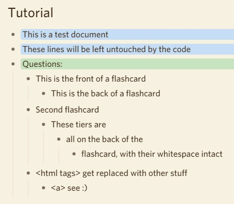
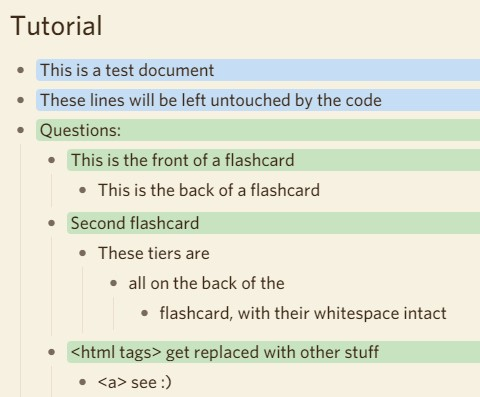
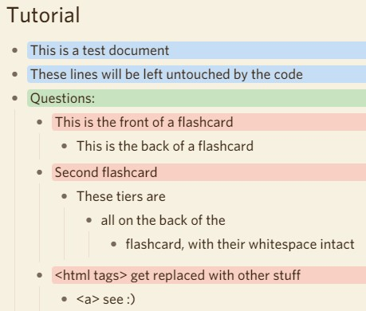
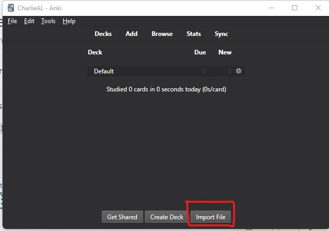
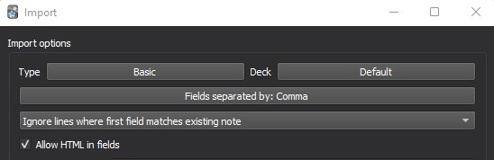

# dynalist_to_csv
Turns dynalist flashcard-style notes into csv format (for e.g. anki)

See below for the features, how to use the scraper & how to get it onto anki

# Features:
- Only Processes certain notes within a document, chosen by you
  - These are those notes which have a parent somewhere called 'Question' (see below)
  - Notes which are colored green will be ignored (to not repeat flashcarding)
- Supports unlimited levels of nested-ness
- Handles hidden html tags within the notes (changes <> to [])
- Handles delimiter collision, with support to change the delimiter (see config.py)
- Can revert the color changes if you don't like it (config.py again)

# HOW TO USE:
- Put all the files you want to turn into flashcards under a 'Questions:' bullet point. Like this:

- Edit config.py to include your API token, get it from here https://dynalist.io/developer
- Run main.py & select the file you want to scrape in the console using a number
- Check your csvs folder for the magic ;)
- Type 'revert' to undo the changes

## After scraping: 

## After reverting: (Color is customisable)

# How to get it onto Anki?

## Have settings looking like this (unless you changed the delimiter)

Future improvements:
- add funcitonality to swap $$ $$ -> \( \) - to enable latex code to work from dynalist to anki
